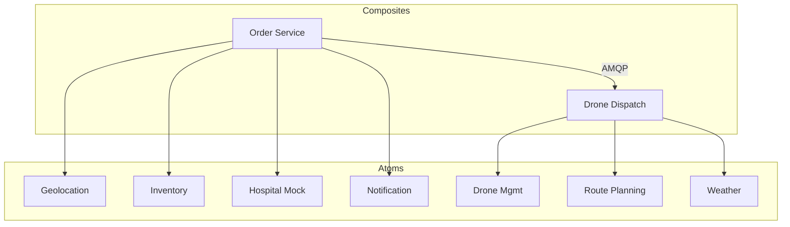

# 🛸 Medi-Drone Architecture

**Medi-Drone** is a cutting-edge fleet management and logstics platform for medical drone deliveries. This repository features a modernized microservices architecture designed for scalability, observability, and high-precision mission control.

---

## 🏗️ System Architecture

The ecosystem is divided into specialized **Atoms** (low-level utility services) and **Composites** (orchestration layers), following a clean microservices pattern.



---

## 🚀 Optimized Port Ranges

Each service category is assigned a dedicated port range to ensure networking clarity and deterministic service discovery.

| Service Category | Port Range | services |
| :--- | :--- | :--- |
| **Frontend** | `3000-3999` | Dashboards, Mobile App Mock |
| **Atoms** | `4000-4999` | Geolocation, Weather, etc. |
| **Composites** | `5000-5999` | Order, Dispatch |

---

## 🛠️ Technology Stack

- **Framework**: [FastAPI](https://fastapi.tiangolo.com/) (Asynchronous, Type-safe)
- **Persistence**: [Postgres](https://www.postgresql.org/) with [SQLModel](https://sqlmodel.tiangolo.com/) (ORM/Pydantic hybrid)
- **Messaging**: [RabbitMQ](https://www.rabbitmq.com/) (Event-driven choreography)
- **Management**: [uv](https://github.com/astral-sh/uv) (Extremely fast Python workspace management)
- **Documentation**: [Scalar](https://github.com/scalar/scalar) (Served at `/scalar` on every service)
- **Linting**: [Ruff](https://github.com/astral-sh/ruff) (High-fidelity formatting and linting)

---

## 📂 Project Structure

```text
Medi-Drone/
├── apps/
│   ├── frontend/      # Frontend
│   ├── atoms/         # Fundamental building blocks
│   ├── composites/    # Business logic orchestration
│   └── shared/        # Shared logic (DB, AMQP, Tracking)
├── infra/             # Infrastructure definitions (RabbitMQ, Kong)
├── pyproject.toml     # Root UV workspace configuration
└── docker-compose.yml # Full ecosystem orchestration
```

---

## 📖 Interactive Documentation

Every backend service in this monorepo serves local API documentation via **Scalar**. Navigation is consistent across the entire platform:

- **Primary Docs**: `http://localhost:<PORT>/scalar`
- **Swagger Docs**: `http://localhost:<PORT>/docs`

---

## 🚦 Getting Started

### Prerequisites

- **Python 3.12+**
- **Docker & Docker Compose**
- **uv** (`pip install uv`)

### Local Launch

1. **Spin up Infrastructure**:
   ```bash
   docker-compose up -d db rabbitmq
   ```
2. **Install Workspace Dependencies**:
   ```bash
   uv sync
   ```
3. **Launch the Service Grid**:
   ```bash
   docker-compose up --build
   ```

---

## 💅 Code Quality

This project enforces strict code quality standards using **Ruff**.

- **Format**: `uv run ruff format .`
- **Lint**: `uv run ruff check .`
